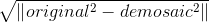
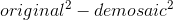
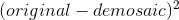

#### Q1. What is squared difference?

or 

or

(original, demosaic means a pixel in a channel)

Answer:

The third is the correct

---

#### Q2. Why there are some noises in my part 2 demosaic result?

Answer:

You need to do some clipping, make sure the pixel values are [0, 1] before converting

